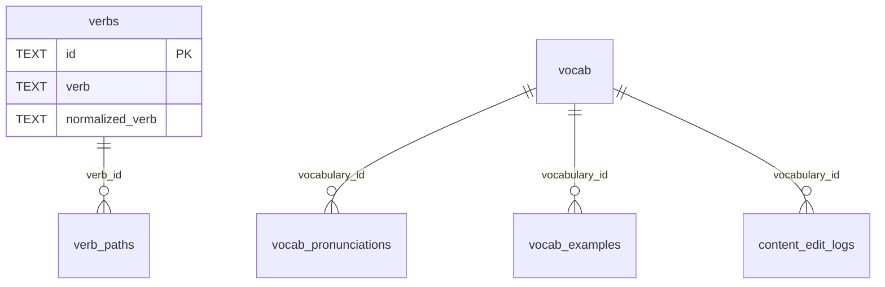

# D1 数据表与字段说明

> 当前公共学习数据 schema 已简化。公共学习数据先保留词库主表、动词主表、动词句子生长路径表、读音表、例句表和编辑日志。
> 来源、授权、生成方式、审核状态等信息不再放在学习业务表中，应记录在数据整理文档、生成批次说明或 `content_edit_logs` 中。

## 表清单

| 表名 | 类型 | 作用 |
|---|---|---|
| `vocab` | 公共词库主表 | 保存单词、核心释义、频率排序和核心音标。 |
| `verbs` | 公共动词主表 | 保存核心动词与动词短语的基础条目。 |
| `verb_paths` | 公共动词句子生长路径表 | 保存动词从主干句到完整句的学习路径和动画步骤。 |
| `vocab_pronunciations` | 公共读音表 | 保存单词读音音标和音频 URL。 |
| `vocab_examples` | 公共例句表 | 保存单词例句及中文解释。 |
| `content_edit_logs` | 管理审计表 | 记录后台编辑前后的 JSON 快照。 |
| `d1_migrations` | 系统表 | D1/Wrangler 迁移记录，不属于业务模型。 |

已移除的旧表：

- `core_vocabulary`
- `vocabulary_pronunciations`
- `vocabulary_examples`
- `vocabulary_senses`
- `vocabulary_collocations`
- `vocabulary_scenarios`
- `vocabulary_scenario_links`
- `profiles`
- `daily_logs`
- `vocabulary_items`

## 关系图

## `vocab`

公共词库主表。它只保存学习卡片和基础查询真正需要的稳定字段。

| 字段 | 类型 | 默认值 | 含义 |
|---|---|---|---|
| `id` | `TEXT PRIMARY KEY` | 无 | 稳定单词 ID。 |
| `word` | `TEXT NOT NULL` | 无 | 单词展示文本。 |
| `normalized_word` | `TEXT NOT NULL`，唯一索引 | 无 | 小写/规范化后的查询键。 |
| `lemma` | `TEXT` | `NULL` | 可选基础词形。 |
| `meaning_zh` | `TEXT NOT NULL` | `''` | 中文核心义。 |
| `definition_en` | `TEXT NOT NULL` | `''` | 英文短释义。 |
| `frequency_rank` | `INTEGER` | `NULL` | 频率排序，数字越小越优先。 |
| `phonetic_us` | `TEXT NOT NULL` | `''` | 美音 IPA。 |
| `phonetic_uk` | `TEXT NOT NULL` | `''` | 英音 IPA。 |
| `created_at` | `TEXT NOT NULL` | `CURRENT_TIMESTAMP` | 创建时间。 |
| `updated_at` | `TEXT NOT NULL` | `CURRENT_TIMESTAMP` | 更新时间。 |

索引：

| 索引名 | 字段 | 用途 |
|---|---|---|
| `idx_vocab_normalized_word` | `normalized_word` | 单词精确查询与去重。 |
| `idx_vocab_frequency_rank` | `frequency_rank` | 默认列表排序、覆盖率检查和运维查询。 |

## `verbs`

公共动词主表。它只保存动词学习底稿真正需要的基础字段；句子生长路径、主干与修饰步骤后续由独立表承载。

| 字段 | 类型 | 默认值 | 含义 |
|---|---|---|---|
| `id` | `TEXT PRIMARY KEY` | 无 | 稳定动词 ID，使用规范化动词生成的 slug。 |
| `verb` | `TEXT NOT NULL` | 无 | 动词展示文本，比如 `deploy`、`depend on`。 |
| `normalized_verb` | `TEXT NOT NULL`，唯一索引 | 无 | 小写/规范化后的查询键。 |
| `meaning_zh` | `TEXT NOT NULL` | 无 | 中文核心义。 |
| `is_phrase` | `INTEGER NOT NULL` | `0` | 是否为动词短语：`0` 单动词，`1` 短语动词。 |
| `created_at` | `TEXT NOT NULL` | `CURRENT_TIMESTAMP` | 创建时间。 |
| `updated_at` | `TEXT NOT NULL` | `CURRENT_TIMESTAMP` | 更新时间。 |

索引：

| 索引名 | 字段 | 用途 |
|---|---|---|
| `idx_verbs_normalized_verb` | `normalized_verb` | 动词精确查询与去重。 |
| `idx_verbs_is_phrase` | `is_phrase` | 区分单动词与短语动词。 |

## `verb_paths`

公共动词句子生长路径表。它负责保存一个动词在某个开发者场景下，如何从“主干句”逐步生长为“完整句”。页面展示时只使用“主干”和“修饰”这类直观概念，不展示复杂语法术语。

| 字段 | 类型 | 默认值 | 含义 |
|---|---|---|---|
| `id` | `TEXT PRIMARY KEY` | 无 | 稳定路径 ID。 |
| `verb_id` | `TEXT NOT NULL`，外键到 `verbs(id)` | 无 | 关联动词主表。 |
| `verb` | `TEXT NOT NULL` | 无 | 冗余动词文本，方便查询、后台展示和减少简单场景关联查询。 |
| `title` | `TEXT NOT NULL` | 无 | 路径标题，用于区分同一动词的不同学习路径。 |
| `meaning_zh` | `TEXT NOT NULL` | 无 | 这条路径里的中文核心含义。 |
| `core_sentence_en` | `TEXT NOT NULL` | 无 | 主干句英文。 |
| `core_sentence_zh` | `TEXT NOT NULL` | 无 | 主干句中文。 |
| `full_sentence_en` | `TEXT NOT NULL` | 无 | 最终成品句英文，通常等于 `growth_json.steps` 最后一步的 `sentence_en`。 |
| `full_sentence_zh` | `TEXT NOT NULL` | 无 | 最终成品句中文。 |
| `scene` | `TEXT NOT NULL` | `''` | 开发者学习场景，如 `code`、`debug`、`deploy`、`system`。 |
| `growth_json` | `TEXT NOT NULL` | 空结构 JSON | 统一句子生长 JSON，包含节点、连线和动画步骤，用于树状结构展示。 |
| `created_at` | `TEXT NOT NULL` | `CURRENT_TIMESTAMP` | 创建时间。 |
| `updated_at` | `TEXT NOT NULL` | `CURRENT_TIMESTAMP` | 更新时间。 |

索引：

| 索引名 | 字段 | 用途 |
|---|---|---|
| `idx_verb_paths_verb_id` | `verb_id` | 按动词读取学习路径。 |
| `idx_verb_paths_verb` | `verb` | 直接按动词文本查询路径。 |
| `idx_verb_paths_scene` | `scene` | 按开发者场景筛选路径。 |

`growth_json` 约定：

节点关系如何转换为 SVG、箭头方向如何确定，以及嵌套动作如何绘制，必须遵循
[`sentence-svg-diagram-standard.md`](./sentence-svg-diagram-standard.md)。该文件是相关生成与展示规则的唯一权威规范。

| 顶层字段 | 含义 |
|---|---|
| `schema_version` | 当前结构版本。新版严谨关系树固定为 `2`。 |
| `root_action_id` | 主要动作节点 ID；复杂句允许存在多个 `action`，但必须明确一个视觉与语义根节点。 |
| `nodes` | 句子里的词块节点，比如动作、主干词块、修饰词块。 |
| `links` | 节点之间的关系，说明谁连接谁、谁补充谁。 |
| `steps` | 动画播放步骤，说明每一步新增哪些节点和连线。 |

`growth_json.nodes`：

| 字段 | 含义 |
|---|---|
| `id` | 节点唯一 ID。 |
| `text` | 页面展示文本。 |
| `kind` | 节点类型：`action` 核心动作，`core` 主干词块，`modifier` 修饰词块。 |
| `label_zh` | 根据当前句子的真实语境独立生成的角色说明，回答这个词块在本句中具体做什么；禁止由 `kind` 套用通用标签。 |

`growth_json.links`：

| 字段 | 含义 |
|---|---|
| `id` | 连线唯一 ID，通常为 `from->to`。 |
| `from` | 起点节点 ID。 |
| `to` | 终点节点 ID。 |
| `kind` | 连线类型：`core` 主干连接，`modifier` 修饰连接。 |
| `relation_type` | 程序内部关系分类，如 `actor`、`target`、`nested_action`、`time`、`purpose`，用于校验和布局，不直接展示给学习者。 |
| `label_zh` | 根据当前句子的实际关系独立生成的中文说明；禁止直接翻译 `relation_type` 或套用通用文案。 |

`growth_json.steps`：

| 字段 | 含义 |
|---|---|
| `step_no` | 步骤序号，从 1 开始。 |
| `label` | 页面展示标签，如“主干”“加一点时间”“加一点目的”，可按词条场景变化。 |
| `sentence_en` | 当前步骤展示的英文句子。 |
| `sentence_zh` | 当前步骤中文解释。 |
| `add_node_ids` | 这一步新加入的节点 ID。 |
| `add_link_ids` | 这一步新加入的连线 ID。 |
| `focus_node_id` | 这一步重点观察的节点 ID。 |
| `note_zh` | 给学习者看的简短说明。 |

`growth_json V2` 只固定结构协议，不固定内容模板。除字段名称、枚举范围、ID 格式、
连线方向和步骤编号外，路径标题、场景、句子、翻译、节点拆分、节点类型、节点标签、
关系类型、关系标签、步骤数量、步骤顺序和学习提示，都必须根据当前句子的实际语境重新
分析并生成。不得复用历史 V1 节点关系，也不得通过替换少量动词或名词批量套用模板。

## `vocab_pronunciations`

公共读音表。当前不再保存口音、来源、授权、音频供应商、质量状态等流程字段。

| 字段 | 类型 | 默认值 | 含义 |
|---|---|---|---|
| `id` | `TEXT PRIMARY KEY` | 无 | 稳定读音行 ID。历史 US/UK 行通过 ID 保留。 |
| `vocabulary_id` | `TEXT NOT NULL`，外键到 `vocab(id)` | 无 | 关联单词。 |
| `word` | `TEXT NOT NULL` | 无 | 冗余单词文本，方便后台直接读取。 |
| `phonetic` | `TEXT NOT NULL` | `''` | 音标文本。 |
| `audio_url` | `TEXT NOT NULL` | `''` | 可播放音频 URL。 |
| `created_at` | `TEXT NOT NULL` | `CURRENT_TIMESTAMP` | 创建时间。 |
| `updated_at` | `TEXT NOT NULL` | `CURRENT_TIMESTAMP` | 更新时间。 |

索引：

| 索引名 | 字段 | 用途 |
|---|---|---|
| `idx_vocab_pronunciations_vocabulary` | `vocabulary_id` | 按单词读取读音。 |
| `idx_vocab_pronunciations_word` | `word` | 直接按单词文本查询读音。 |

## `vocab_examples`

公共例句表。当前不再保存义项关联、来源、难度、发布状态和审核时间。

| 字段 | 类型 | 默认值 | 含义 |
|---|---|---|---|
| `id` | `TEXT PRIMARY KEY` | 无 | 稳定例句行 ID。 |
| `vocabulary_id` | `TEXT NOT NULL`，外键到 `vocab(id)` | 无 | 关联单词。 |
| `word` | `TEXT NOT NULL` | 无 | 冗余单词文本，方便后台直接读取。 |
| `sentence_en` | `TEXT NOT NULL` | 无 | 英文例句。 |
| `sentence_zh` | `TEXT NOT NULL` | `''` | 中文解释或翻译。 |
| `created_at` | `TEXT NOT NULL` | `CURRENT_TIMESTAMP` | 创建时间。 |
| `updated_at` | `TEXT NOT NULL` | `CURRENT_TIMESTAMP` | 更新时间。 |

索引：

| 索引名 | 字段 | 用途 |
|---|---|---|
| `idx_vocab_examples_vocabulary` | `vocabulary_id` | 按单词读取例句。 |
| `idx_vocab_examples_word` | `word` | 直接按单词文本查询例句。 |

## `content_edit_logs`

后台编辑审计表。它不是公共学习数据主流程的一部分，可以保留较完整的编辑前后快照。

| 字段 | 类型 | 默认值 | 含义 |
|---|---|---|---|
| `id` | `TEXT PRIMARY KEY` | 无 | 编辑日志 ID。 |
| `vocabulary_id` | `TEXT` | `NULL` | 关联词条 ID。 |
| `entity_type` | `TEXT NOT NULL` | 无 | 编辑实体类型，如 `vocab_bundle`。 |
| `entity_id` | `TEXT NOT NULL` | 无 | 编辑实体 ID。 |
| `action` | `TEXT NOT NULL` | 无 | 操作类型，如 `update`。 |
| `editor` | `TEXT NOT NULL` | `'unknown'` | 编辑人标记。 |
| `before_json` | `TEXT NOT NULL` | `'{}'` | 修改前 JSON 快照。 |
| `after_json` | `TEXT NOT NULL` | `'{}'` | 修改后 JSON 快照。 |
| `created_at` | `TEXT NOT NULL` | `CURRENT_TIMESTAMP` | 日志时间。 |
