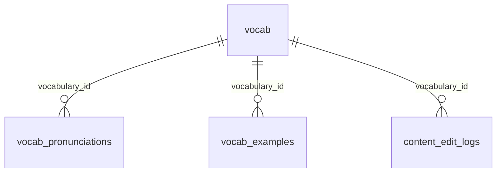

# D1 数据表与字段说明

> 当前公共词库 schema 已简化。公共学习数据只保留词库主表、读音表、例句表和编辑日志。
> 来源、授权、生成方式、审核状态等信息不再放在学习业务表中，应记录在数据整理文档、批次说明、迁移文件或 `content_edit_logs` 中。

## 表清单

| 表名 | 类型 | 作用 |
|---|---|---|
| `vocab` | 公共词库主表 | 保存单词、核心释义、频率排序和核心音标。 |
| `vocab_pronunciations` | 公共读音表 | 保存单词读音音标和音频 URL。 |
| `vocab_examples` | 公共例句表 | 保存单词例句及中文解释。 |
| `content_edit_logs` | 管理审计表 | 记录后台编辑前后的 JSON 快照。 |
| `d1_migrations` | 系统表 | D1/Wrangler 迁移记录，不属于业务模型。 |

已移除的旧表：

- `core_vocabulary`
- `vocabulary_pronunciations`
- `vocabulary_examples`
- `vocabulary_senses`
- `vocabulary_collocations`
- `vocabulary_scenarios`
- `vocabulary_scenario_links`
- `profiles`
- `daily_logs`
- `vocabulary_items`

## 关系图

## `vocab`

公共词库主表。它只保存学习卡片和基础查询真正需要的稳定字段。

| 字段 | 类型 | 默认值 | 含义 |
|---|---|---|---|
| `id` | `TEXT PRIMARY KEY` | 无 | 稳定单词 ID。 |
| `word` | `TEXT NOT NULL` | 无 | 单词展示文本。 |
| `normalized_word` | `TEXT NOT NULL`，唯一索引 | 无 | 小写/规范化后的查询键。 |
| `lemma` | `TEXT` | `NULL` | 可选基础词形。 |
| `meaning_zh` | `TEXT NOT NULL` | `''` | 中文核心义。 |
| `definition_en` | `TEXT NOT NULL` | `''` | 英文短释义。 |
| `frequency_rank` | `INTEGER` | `NULL` | 频率排序，数字越小越优先。 |
| `phonetic_us` | `TEXT NOT NULL` | `''` | 美音 IPA。 |
| `phonetic_uk` | `TEXT NOT NULL` | `''` | 英音 IPA。 |
| `created_at` | `TEXT NOT NULL` | `CURRENT_TIMESTAMP` | 创建时间。 |
| `updated_at` | `TEXT NOT NULL` | `CURRENT_TIMESTAMP` | 更新时间。 |

索引：

| 索引名 | 字段 | 用途 |
|---|---|---|
| `idx_vocab_normalized_word` | `normalized_word` | 单词精确查询与去重。 |
| `idx_vocab_frequency_rank` | `frequency_rank` | 高频词排序与 Top N 查询。 |

## `vocab_pronunciations`

公共读音表。当前不再保存口音、来源、授权、音频供应商、质量状态等流程字段。

| 字段 | 类型 | 默认值 | 含义 |
|---|---|---|---|
| `id` | `TEXT PRIMARY KEY` | 无 | 稳定读音行 ID。历史 US/UK 行通过 ID 保留。 |
| `vocabulary_id` | `TEXT NOT NULL`，外键到 `vocab(id)` | 无 | 关联单词。 |
| `word` | `TEXT NOT NULL` | 无 | 冗余单词文本，方便后台直接读取。 |
| `phonetic` | `TEXT NOT NULL` | `''` | 音标文本。 |
| `audio_url` | `TEXT NOT NULL` | `''` | 可播放音频 URL。 |
| `created_at` | `TEXT NOT NULL` | `CURRENT_TIMESTAMP` | 创建时间。 |
| `updated_at` | `TEXT NOT NULL` | `CURRENT_TIMESTAMP` | 更新时间。 |

索引：

| 索引名 | 字段 | 用途 |
|---|---|---|
| `idx_vocab_pronunciations_vocabulary` | `vocabulary_id` | 按单词读取读音。 |
| `idx_vocab_pronunciations_word` | `word` | 直接按单词文本查询读音。 |

## `vocab_examples`

公共例句表。当前不再保存义项关联、来源、难度、发布状态和审核时间。

| 字段 | 类型 | 默认值 | 含义 |
|---|---|---|---|
| `id` | `TEXT PRIMARY KEY` | 无 | 稳定例句行 ID。 |
| `vocabulary_id` | `TEXT NOT NULL`，外键到 `vocab(id)` | 无 | 关联单词。 |
| `word` | `TEXT NOT NULL` | 无 | 冗余单词文本，方便后台直接读取。 |
| `sentence_en` | `TEXT NOT NULL` | 无 | 英文例句。 |
| `sentence_zh` | `TEXT NOT NULL` | `''` | 中文解释或翻译。 |
| `created_at` | `TEXT NOT NULL` | `CURRENT_TIMESTAMP` | 创建时间。 |
| `updated_at` | `TEXT NOT NULL` | `CURRENT_TIMESTAMP` | 更新时间。 |

索引：

| 索引名 | 字段 | 用途 |
|---|---|---|
| `idx_vocab_examples_vocabulary` | `vocabulary_id` | 按单词读取例句。 |
| `idx_vocab_examples_word` | `word` | 直接按单词文本查询例句。 |

## `content_edit_logs`

后台编辑审计表。它不是公共学习数据主流程的一部分，可以保留较完整的编辑前后快照。

| 字段 | 类型 | 默认值 | 含义 |
|---|---|---|---|
| `id` | `TEXT PRIMARY KEY` | 无 | 编辑日志 ID。 |
| `vocabulary_id` | `TEXT` | `NULL` | 关联词条 ID。 |
| `entity_type` | `TEXT NOT NULL` | 无 | 编辑实体类型，如 `vocab_bundle`。 |
| `entity_id` | `TEXT NOT NULL` | 无 | 编辑实体 ID。 |
| `action` | `TEXT NOT NULL` | 无 | 操作类型，如 `update`。 |
| `editor` | `TEXT NOT NULL` | `'unknown'` | 编辑人标记。 |
| `before_json` | `TEXT NOT NULL` | `'{}'` | 修改前 JSON 快照。 |
| `after_json` | `TEXT NOT NULL` | `'{}'` | 修改后 JSON 快照。 |
| `created_at` | `TEXT NOT NULL` | `CURRENT_TIMESTAMP` | 日志时间。 |
