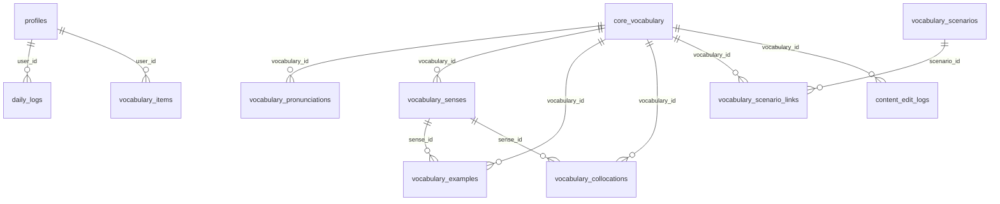

# D1 数据表与字段说明

> 更新时间：2026-05-21  
> 范围：基于当前远端 D1 已存在表，以及仓库内 `migrations/` 的表结构定义整理。本文档说明业务表字段含义；`d1_migrations` 为 Wrangler/D1 迁移记录表，单独列在最后。

## 表总览

| 表名 | 类型 | 主要用途 | 备注 |
| --- | --- | --- | --- |
| `profiles` | 用户表 | 保存用户基础学习档案 | 早期 MVP 用户数据表，目前未做强外键约束 |
| `daily_logs` | 用户表 | 保存用户每日学习记录 | 以 `user_id + log_date` 作为联合主键 |
| `vocabulary_items` | 用户表 | 保存用户自建词条 | 早期用户个人词库表 |
| `core_vocabulary` | 公共词库主表 | 保存公共核心词汇的稳定摘要数据 | 子表通过 `vocabulary_id` 关联它 |
| `vocabulary_pronunciations` | 公共内容子表 | 保存单词读音、音标、音频与来源元数据 | 支持美音、英音等多口音 |
| `vocabulary_senses` | 公共内容子表 | 保存单词常见义项 | 一个单词可有多个义项 |
| `vocabulary_examples` | 公共内容子表 | 保存例句 | 可关联到具体义项 |
| `vocabulary_collocations` | 公共内容子表 | 保存常见搭配、短语、固定表达 | 可关联到具体义项 |
| `vocabulary_scenarios` | 公共内容字典表 | 保存使用场景分类 | 如日常、学习、工作等 |
| `vocabulary_scenario_links` | 公共内容关联表 | 建立单词与使用场景的多对多关系 | `vocabulary_id + scenario_id` 联合主键 |
| `content_edit_logs` | 公共内容审计表 | 记录数据后台对公共词库的修改快照 | 当前后台不做账号鉴权，`editor` 由页面填写 |
| `d1_migrations` | 系统表 | 保存 D1 迁移执行记录 | Wrangler 自动维护，不属于业务模型 |

## 关系概览

说明：公共词库子表里保留了 `word` 和 `normalized_word` 冗余字段，这是有意设计。`vocabulary_id` 负责稳定关联主表；`word` 方便直接展示；`normalized_word` 方便不关联主表时按单词查询读音、例句等内容。

## `profiles`

保存用户基础学习档案。

| 字段 | 类型/约束 | 默认值 | 字段含义 |
| --- | --- | --- | --- |
| `user_id` | `TEXT PRIMARY KEY` | 无 | 用户唯一标识。 |
| `email` | `TEXT NOT NULL` | 无 | 用户邮箱。 |
| `name` | `TEXT NOT NULL` | 无 | 用户显示名称。 |
| `goal` | `TEXT NOT NULL` | 无 | 用户学习目标。 |
| `level` | `TEXT NOT NULL` | 无 | 用户当前英语水平。 |
| `minutes_per_day` | `INTEGER NOT NULL` | 无 | 用户计划每天学习分钟数。 |
| `created_at` | `TEXT NOT NULL` | 无 | 创建时间。 |
| `updated_at` | `TEXT NOT NULL` | 无 | 最近更新时间。 |

## `daily_logs`

保存用户每日学习记录。

| 字段 | 类型/约束 | 默认值 | 字段含义 |
| --- | --- | --- | --- |
| `user_id` | `TEXT NOT NULL`，联合主键之一 | 无 | 用户唯一标识。 |
| `log_date` | `TEXT NOT NULL`，联合主键之一 | 无 | 学习记录日期。建议使用 `YYYY-MM-DD`。 |
| `completed_task_ids` | `TEXT NOT NULL` | `'[]'` | 当天已完成任务 ID 列表，当前以 JSON 字符串保存。 |
| `reflection` | `TEXT NOT NULL` | `''` | 当天学习反思或备注。 |
| `minutes_logged` | `INTEGER NOT NULL` | `0` | 当天实际学习分钟数。 |
| `updated_at` | `TEXT NOT NULL` | 无 | 最近更新时间。 |

主键：`PRIMARY KEY (user_id, log_date)`。

## `vocabulary_items`

保存用户自建词条，偏早期个人词库用途。

| 字段 | 类型/约束 | 默认值 | 字段含义 |
| --- | --- | --- | --- |
| `id` | `TEXT PRIMARY KEY` | 无 | 用户词条唯一标识。 |
| `user_id` | `TEXT NOT NULL` | 无 | 所属用户标识。 |
| `word` | `TEXT NOT NULL` | 无 | 用户记录的单词或短语。 |
| `meaning` | `TEXT NOT NULL` | 无 | 用户记录的中文释义或个人理解。 |
| `example` | `TEXT NOT NULL` | `''` | 用户记录的例句。 |
| `created_at` | `TEXT NOT NULL` | 无 | 创建时间。 |
| `updated_at` | `TEXT NOT NULL` | 无 | 最近更新时间。 |

## `core_vocabulary`

公共核心词汇主表。它保存单词最常用、最稳定、列表页和学习卡片高频读取的数据。

| 字段 | 类型/约束 | 默认值 | 字段含义 |
| --- | --- | --- | --- |
| `id` | `TEXT PRIMARY KEY` | 无 | 稳定词条 ID。通常使用规范化后的单词，如 `money`。 |
| `word` | `TEXT NOT NULL` | 无 | 展示给学习者看的单词或短语。 |
| `normalized_word` | `TEXT NOT NULL`，唯一索引 | 无 | 小写/规范化搜索键，用于去重和查询。 |
| `entry_type` | `TEXT NOT NULL`，`word` / `phrase` | `'word'` | 词条类型：单词或短语。 |
| `lemma` | `TEXT` | `NULL` | 词元或基础形式，例如 `children` 可指向 `child`。 |
| `meaning_zh` | `TEXT NOT NULL` | `''` | 中文核心义，学习卡片优先展示。 |
| `definition_en` | `TEXT NOT NULL` | `''` | 英文短释义。当前公共内容采用自写释义。 |
| `primary_part_of_speech` | `TEXT NOT NULL` | 无 | 主要词性，用于筛选和基础展示。 |
| `level` | `TEXT NOT NULL`，`A1` / `A2` / `B1` / `B2` | 无 | 学习难度等级。 |
| `frequency_rank` | `INTEGER` | `NULL` | 出现频率排序，数值越小越常见。 |
| `frequency_band` | `TEXT`，`top-100` / `top-500` / `top-1000` / `top-3000` | `NULL` | 频率分桶。 |
| `learning_priority` | `INTEGER NOT NULL` | 无 | 产品内学习优先级，数值越小越优先学习。 |
| `publish_status` | `TEXT NOT NULL`，`active` / `archived` | `'active'` | 词条发布状态。 |
| `note` | `TEXT NOT NULL` | `''` | 过渡备注或内部说明。 |
| `created_at` | `TEXT NOT NULL` | `CURRENT_TIMESTAMP` | 创建时间。 |
| `updated_at` | `TEXT NOT NULL` | `CURRENT_TIMESTAMP` | 最近更新时间。 |
| `reviewed_at` | `TEXT` | `NULL` | 人工审核时间；为空表示尚未审核。 |
| `phonetic_us` | `TEXT NOT NULL` | `''` | 美音 IPA，作为列表和学习卡片的快捷展示字段。 |
| `phonetic_uk` | `TEXT NOT NULL` | `''` | 英音 IPA，作为列表和学习卡片的快捷展示字段。 |

## `vocabulary_pronunciations`

保存公共词汇的读音、音标、音频地址和来源元数据。它是读音资产的主表。

| 字段 | 类型/约束 | 默认值 | 字段含义 |
| --- | --- | --- | --- |
| `id` | `TEXT PRIMARY KEY` | 无 | 读音记录唯一标识，通常类似 `{vocabulary_id}-us`。 |
| `vocabulary_id` | `TEXT NOT NULL`，外键到 `core_vocabulary(id)` | 无 | 所属核心词条 ID。删除主词条时级联删除。 |
| `word` | `TEXT NOT NULL` | 无 | 冗余展示单词，便于直接读取。 |
| `normalized_word` | `TEXT NOT NULL` | 无 | 冗余规范化单词，便于按单词直接查询读音。 |
| `accent` | `TEXT NOT NULL`，`global` / `us` / `uk` / `other` | `'global'` | 读音口音或变体。 |
| `phonetic` | `TEXT NOT NULL` | `''` | 此读音变体对应的 IPA 或学习者友好音标。 |
| `audio_url` | `TEXT NOT NULL` | `''` | 稳定音频 URL，目前指向 R2 公共地址。 |
| `audio_source` | `TEXT NOT NULL`，`none` / `tts` / `manual` / `external` | `'none'` | 音频来源类别。 |
| `sort_order` | `INTEGER NOT NULL` | `0` | 同一词条多个读音的展示顺序。 |
| `publish_status` | `TEXT NOT NULL`，`active` / `archived` | `'active'` | 读音是否对学习者可见。 |
| `created_at` | `TEXT NOT NULL` | `CURRENT_TIMESTAMP` | 创建时间。 |
| `updated_at` | `TEXT NOT NULL` | `CURRENT_TIMESTAMP` | 最近更新时间。 |
| `reviewed_at` | `TEXT` | `NULL` | 人工听音/校验时间；为空表示尚未审核。 |
| `locale` | `TEXT NOT NULL` | `''` | 语言区域，如 `en-US`、`en-GB`。 |
| `phonetic_source` | `TEXT NOT NULL` | `''` | 音标来源或整理状态，如 `manual-curation-pending-review`。 |
| `phonetic_source_url` | `TEXT NOT NULL` | `''` | 音标来源链接；自整理或无来源时为空。 |
| `audio_provider` | `TEXT NOT NULL` | `''` | 具体音频生成/提供方，如 `macos-say`。 |
| `voice_id` | `TEXT NOT NULL` | `''` | TTS 声音 ID 或供应商声音名称。 |
| `audio_object_key` | `TEXT NOT NULL` | `''` | R2 对象 key，如 `pronunciations/us/money.m4a`。 |
| `audio_format` | `TEXT NOT NULL`，`''` / `mp3` / `wav` / `ogg` / `aac` | `''` | 音频编码格式。当前生成文件为 AAC 编码的 m4a 容器。 |
| `license` | `TEXT NOT NULL` | `''` | 音频/来源授权说明。 |
| `attribution` | `TEXT NOT NULL` | `''` | 必要的署名或生成说明。 |
| `quality_status` | `TEXT NOT NULL`，`draft` / `generated` / `reviewed` / `needs-review` / `rejected` | `'draft'` | 音频质量状态。自动生成读音通常为 `generated`。 |
| `metadata_json` | `TEXT NOT NULL` | `'{}'` | 扩展元数据，JSON 字符串。 |

## `vocabulary_senses`

保存公共词汇的常见义项。它不追求完整词典，而是保留学习者最有价值的常用义。

| 字段 | 类型/约束 | 默认值 | 字段含义 |
| --- | --- | --- | --- |
| `id` | `TEXT PRIMARY KEY` | 无 | 义项唯一标识，如 `{vocabulary_id}-sense-1`。 |
| `vocabulary_id` | `TEXT NOT NULL`，外键到 `core_vocabulary(id)` | 无 | 所属核心词条 ID。删除主词条时级联删除。 |
| `word` | `TEXT NOT NULL` | 无 | 冗余展示单词。 |
| `normalized_word` | `TEXT NOT NULL` | 无 | 冗余规范化单词。 |
| `part_of_speech` | `TEXT NOT NULL`，限定常见词性 | 无 | 此义项对应的词性。 |
| `meaning_zh` | `TEXT NOT NULL` | `''` | 此义项的中文解释。 |
| `definition_en` | `TEXT NOT NULL` | `''` | 此义项的英文解释。 |
| `usage_note` | `TEXT NOT NULL` | `''` | 使用说明、学习提示或审核说明。 |
| `sense_order` | `INTEGER NOT NULL` | `0` | 同一词条多个义项的展示顺序。 |
| `level` | `TEXT`，可为 `A1` / `A2` / `B1` / `B2` | `NULL` | 当义项难度不同于主词条时使用。 |
| `publish_status` | `TEXT NOT NULL`，`active` / `archived` | `'active'` | 义项发布状态。 |
| `created_at` | `TEXT NOT NULL` | `CURRENT_TIMESTAMP` | 创建时间。 |
| `updated_at` | `TEXT NOT NULL` | `CURRENT_TIMESTAMP` | 最近更新时间。 |
| `reviewed_at` | `TEXT` | `NULL` | 人工审核时间。 |

`part_of_speech` 允许值：`noun`、`verb`、`adjective`、`adverb`、`phrase`、`pronoun`、`preposition`、`conjunction`、`determiner`、`modal`、`interjection`、`number`。

## `vocabulary_examples`

保存公共词汇的例句。Top 1000 以内以自写内容为主；Top 3000 扩展使用 WordNet-assisted 与生成例句混合的可审核启动数据，避免直接搬运受版权限制的商业词典内容。

| 字段 | 类型/约束 | 默认值 | 字段含义 |
| --- | --- | --- | --- |
| `id` | `TEXT PRIMARY KEY` | 无 | 例句唯一标识，如 `{vocabulary_id}-example-1`。 |
| `vocabulary_id` | `TEXT NOT NULL`，外键到 `core_vocabulary(id)` | 无 | 所属核心词条 ID。删除主词条时级联删除。 |
| `word` | `TEXT NOT NULL` | 无 | 冗余展示单词。 |
| `normalized_word` | `TEXT NOT NULL` | 无 | 冗余规范化单词。 |
| `sense_id` | `TEXT`，外键到 `vocabulary_senses(id)` | `NULL` | 例句对应义项；为空表示通用例句。义项删除时置空。 |
| `sentence_en` | `TEXT NOT NULL` | 无 | 英文例句。 |
| `sentence_zh` | `TEXT NOT NULL` | `''` | 中文翻译或学习解释。 |
| `source_type` | `TEXT NOT NULL`，`manual` / `generated` / `imported` | `'manual'` | 例句创建方式。 |
| `source_ref` | `TEXT NOT NULL` | `''` | 来源说明、导入批次或审核标记。 |
| `difficulty` | `TEXT`，`easy` / `medium` / `hard` | `NULL` | 例句难度。 |
| `example_order` | `INTEGER NOT NULL` | `0` | 同一词条多个例句的展示顺序。 |
| `publish_status` | `TEXT NOT NULL`，`active` / `archived` | `'active'` | 例句发布状态。 |
| `created_at` | `TEXT NOT NULL` | `CURRENT_TIMESTAMP` | 创建时间。 |
| `updated_at` | `TEXT NOT NULL` | `CURRENT_TIMESTAMP` | 最近更新时间。 |
| `reviewed_at` | `TEXT` | `NULL` | 人工审核时间。 |

## `vocabulary_collocations`

保存搭配、短语、固定表达、短语动词或习语。它是条件内容：只有学习价值明确时才补。

| 字段 | 类型/约束 | 默认值 | 字段含义 |
| --- | --- | --- | --- |
| `id` | `TEXT PRIMARY KEY` | 无 | 搭配记录唯一标识，如 `{vocabulary_id}-collocation-1`。 |
| `vocabulary_id` | `TEXT NOT NULL`，外键到 `core_vocabulary(id)` | 无 | 所属核心词条 ID。删除主词条时级联删除。 |
| `word` | `TEXT NOT NULL` | 无 | 冗余展示单词。 |
| `normalized_word` | `TEXT NOT NULL` | 无 | 冗余规范化单词。 |
| `sense_id` | `TEXT`，外键到 `vocabulary_senses(id)` | `NULL` | 搭配对应义项；为空表示通用搭配。义项删除时置空。 |
| `phrase` | `TEXT NOT NULL` | 无 | 搭配、短语或表达本体。 |
| `normalized_phrase` | `TEXT NOT NULL` | 无 | 规范化搭配文本，用于检索和去重。 |
| `meaning_zh` | `TEXT NOT NULL` | `''` | 搭配中文含义。 |
| `example_en` | `TEXT NOT NULL` | `''` | 使用该搭配的英文例句。 |
| `example_zh` | `TEXT NOT NULL` | `''` | 搭配例句的中文翻译。 |
| `collocation_type` | `TEXT NOT NULL`，`phrase` / `pattern` / `fixed-expression` / `phrasal-verb` / `idiom` | `'phrase'` | 搭配类型。 |
| `sort_order` | `INTEGER NOT NULL` | `0` | 同一词条多个搭配的展示顺序。 |
| `publish_status` | `TEXT NOT NULL`，`active` / `archived` | `'active'` | 搭配发布状态。 |
| `created_at` | `TEXT NOT NULL` | `CURRENT_TIMESTAMP` | 创建时间。 |
| `updated_at` | `TEXT NOT NULL` | `CURRENT_TIMESTAMP` | 最近更新时间。 |
| `reviewed_at` | `TEXT` | `NULL` | 人工审核时间。 |

## `vocabulary_scenarios`

保存公共词汇使用场景分类。

| 字段 | 类型/约束 | 默认值 | 字段含义 |
| --- | --- | --- | --- |
| `id` | `TEXT PRIMARY KEY` | 无 | 场景唯一标识，如 `daily`、`study`、`work`。 |
| `name_zh` | `TEXT NOT NULL` | 无 | 中文场景名称。 |
| `name_en` | `TEXT NOT NULL` | 无 | 英文场景名称。 |
| `description` | `TEXT NOT NULL` | `''` | 场景说明。 |
| `sort_order` | `INTEGER NOT NULL` | `0` | 场景在筛选器或列表中的展示顺序。 |
| `publish_status` | `TEXT NOT NULL`，`active` / `archived` | `'active'` | 场景发布状态。 |
| `created_at` | `TEXT NOT NULL` | `CURRENT_TIMESTAMP` | 创建时间。 |
| `updated_at` | `TEXT NOT NULL` | `CURRENT_TIMESTAMP` | 最近更新时间。 |

## `vocabulary_scenario_links`

建立核心词汇与使用场景之间的多对多关系。

| 字段 | 类型/约束 | 默认值 | 字段含义 |
| --- | --- | --- | --- |
| `vocabulary_id` | `TEXT NOT NULL`，联合主键之一，外键到 `core_vocabulary(id)` | 无 | 所属核心词条 ID。删除主词条时级联删除。 |
| `word` | `TEXT NOT NULL` | 无 | 冗余展示单词。 |
| `normalized_word` | `TEXT NOT NULL` | 无 | 冗余规范化单词。 |
| `scenario_id` | `TEXT NOT NULL`，联合主键之一，外键到 `vocabulary_scenarios(id)` | 无 | 关联场景 ID。删除场景时级联删除。 |
| `relevance` | `INTEGER NOT NULL`，范围 `0`–`100` | `50` | 单词与该场景的相关度，数值越高越相关。 |
| `created_at` | `TEXT NOT NULL` | `CURRENT_TIMESTAMP` | 创建时间。 |

主键：`PRIMARY KEY (vocabulary_id, scenario_id)`。

## `content_edit_logs`

记录数据管理后台对公共内容的一次保存。它不是学习内容本身，而是审计和回溯用的轻量日志。

| 字段 | 类型/约束 | 默认值 | 字段含义 |
| --- | --- | --- | --- |
| `id` | `TEXT PRIMARY KEY` | 无 | 修改日志唯一标识。 |
| `vocabulary_id` | `TEXT` | `NULL` | 关联的核心词条 ID。多数后台词库编辑会填写它。 |
| `entity_type` | `TEXT NOT NULL` | 无 | 被编辑对象类型，例如 `vocabulary_bundle`。 |
| `entity_id` | `TEXT NOT NULL` | 无 | 被编辑对象 ID。词条整包保存时通常等于 `vocabulary_id`。 |
| `action` | `TEXT NOT NULL` | 无 | 修改动作，例如 `update`。 |
| `editor` | `TEXT NOT NULL` | `'unknown'` | 页面上填写的编辑人标记。当前没有账号鉴权时用于基本追踪。 |
| `before_json` | `TEXT NOT NULL` | `'{}'` | 保存前的词条内容快照，JSON 字符串。 |
| `after_json` | `TEXT NOT NULL` | `'{}'` | 保存后的词条内容快照，JSON 字符串。 |
| `created_at` | `TEXT NOT NULL` | `CURRENT_TIMESTAMP` | 修改记录创建时间。 |

## `d1_migrations`

D1/Wrangler 自动维护的迁移记录表。它用于判断哪些迁移已经执行，不承载业务数据。

| 字段 | 类型/约束 | 默认值 | 字段含义 |
| --- | --- | --- | --- |
| `id` | `INTEGER PRIMARY KEY AUTOINCREMENT` | 自动递增 | 迁移记录自增 ID。 |
| `name` | `TEXT UNIQUE` | 无 | 已应用的迁移文件名。 |
| `applied_at` | `TIMESTAMP NOT NULL` | `CURRENT_TIMESTAMP` | 迁移应用时间。 |
